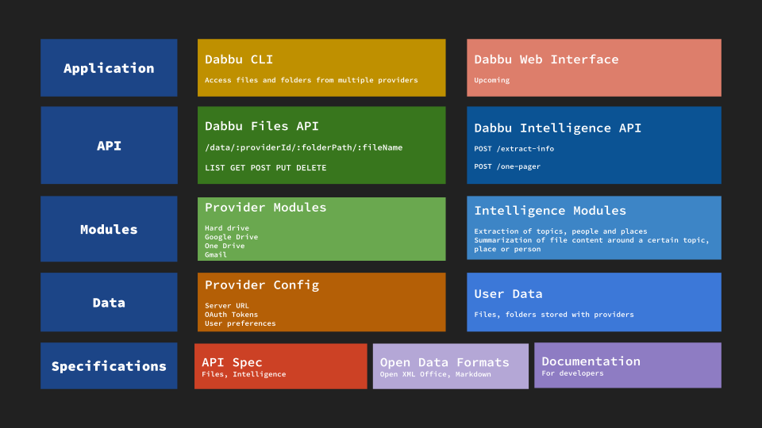

# Reference Architecture

Dabbu is split into multiple layers - _Applications_, _API_, _Modules_, _Data_ and _Specifications_.

Here is a little infographic to illustrate the different layers:

The applications layer represents the apps that end users can use, such as the [Dabbu CLI](../impls/cli).

The API layer includes implementations of the [Dabbu Files API](../files_api/) and the upcoming Dabbu Intelligence API. Apps in the applications layer are supposed to use these APIs.

The modules layer consists of 'modules' or services that return data in a certain format. For example, in the Dabbu Files API, each module interfaces with a provider and converts the data into a uniform, open format.

The data layer includes user data and preferences, along with OAuth tokens and metadata.

The specifications include API specs, resource schemas and documentation.

Each of these layers work together to create the Dabbu Knowledge Platform.
